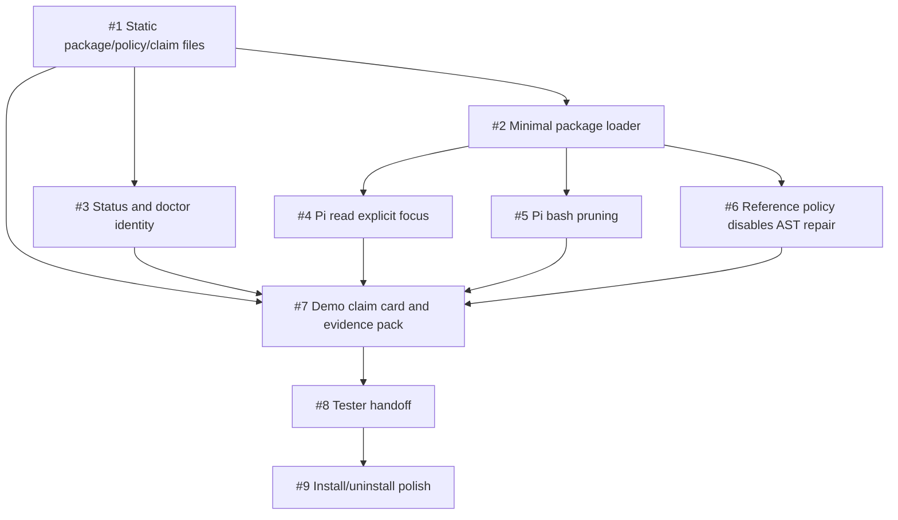

# Needle 1.0 Issue Map

Status: Draft
Date: 2026-06-22
Branch: `needle/1-0-loop-plan`
Source spec: `NEEDLE-1.0-PRD.md`

## Purpose

This file turns the Needle 1.0 PRD into executable work. The goal is to stop
specifying the ontology and start running a tight loop:

1. Pick a small issue.
2. Put it in an isolated worktree.
3. Let a maker agent implement it.
4. Let a separate checker agent review it against the PRD and tests.
5. Merge only when the issue has a visible demo or verification command.
6. Update this file with what is done and what is next.

The loop is inspired by Addy Osmani's "Loop Engineering" framing: the loop has a
state file, isolated worktrees, project knowledge, connectors/tools, and
maker/checker sub-agents. For Needle, this file is the state spine.

## Release Contract

Needle 1.0 is ready for public testers when a Pi user can:

- install Needle,
- use normal Pi `read` and `bash`,
- see whether Needle is down, cold, loading, ready, active, or degraded,
- see exact chars trimmed rather than fake "tokens saved",
- inspect the active `NeedlePackage`, `PruningPolicy`, backend, model directory,
  source checkout, prompt/skill bundle, and claim card,
- verify that `swe-pruner/reference` has AST repair off,
- run one demo fixture that proves visible pruning and pass-through behavior,
- turn Needle off or uninstall it cleanly.

## Loop Rules

- Work from issue-sized branches, not sprawling conversation state.
- Use non-overlapping file ownership when running agents in parallel.
- Keep `NEEDLE-1.0-PRD.md` as the product contract and this file as the work
  queue.
- Every issue must define acceptance criteria, file ownership, and verification.
- Maker and checker must be separate roles. The checker should not be the agent
  that wrote the patch.
- No benchmark reruns until the package/policy/status/demo slice is real.
- No more ontology work unless implementation discovers a contradiction.
- Commits use Conventional Commits.

## Labels

- `p0-1.0-blocker`: required before public tester launch.
- `p1-1.0-support`: helps the launch but can follow the first demo.
- `p2-post-1.0`: useful, but not on the critical path.
- `lane-config`: manifests, package, policy, claim card.
- `lane-pi`: Pi host binding and tool behavior.
- `lane-status`: status, doctor, accounting.
- `lane-engine`: backend/policy behavior.
- `lane-demo`: fixtures, evidence, tester handoff.
- `lane-install`: install, uninstall, model dir hygiene.

## Dependency Map



## Parallel Work Lanes

Wave 1 can run in parallel:

- Lane A, config: issues #1 and #2.
- Lane B, status: issue #3.
- Lane C, Pi tools: issues #4 and #5, split carefully by tool path if possible.
- Lane D, engine: issue #6.
- Lane E, demo: issue #7 can start as a skeleton, then fill after #3-#6 land.

Suggested worktree branches:

- `issue/1-package-policy-files`
- `issue/2-package-loader`
- `issue/3-status-doctor-identity`
- `issue/4-pi-read-focus`
- `issue/5-pi-bash-pruning`
- `issue/6-reference-policy-ast-off`
- `issue/7-demo-evidence-pack`

## Issue Drafts

### #1 Add static NeedlePackage, PruningPolicy, HostBinding, and ClaimCard files

Labels: `p0-1.0-blocker`, `lane-config`

Problem:
The PRD now defines the product around `NeedlePackage`, `PruningPolicy`,
`HostBinding`, and `ClaimCard`, but those are still examples in prose. 1.0 needs
real files the product and testers can point at.

Proposed files:

- `packages/needle/pi-local-mac.yaml`
- `policies/swe-pruner/reference.yaml`
- `policies/needle/soft-lamr.yaml`
- `bindings/pi/native-tools.yaml`
- `claims/pi-local-mac-swe-pruner-reference.yaml`

Acceptance:

- Static files exist and mirror the PRD examples.
- `swe-pruner/reference` declares AST expansion absent.
- `needle/soft-lamr` declares Python AST expansion present.
- Package points to binding, policy, compute target, accounting, claim card, and
  evidence.
- Files are hand-readable and stable enough for `/needle doctor` to display.

Verification:

```bash
python - <<'PY'
from pathlib import Path
for p in [
    "packages/needle/pi-local-mac.yaml",
    "policies/swe-pruner/reference.yaml",
    "policies/needle/soft-lamr.yaml",
    "bindings/pi/native-tools.yaml",
    "claims/pi-local-mac-swe-pruner-reference.yaml",
]:
    assert Path(p).exists(), p
PY
```

Notes:
Do not build a general schema engine in this issue.

### #2 Add minimal package loader and validator

Labels: `p0-1.0-blocker`, `lane-config`

Problem:
The configs should be loadable and reject obvious unresolved references. Without
that, they become decorative YAML.

Acceptance:

- Loader reads the active `NeedlePackage`.
- Loader resolves referenced `PruningPolicy`, `HostBinding`, and `ClaimCard`.
- Missing required references fail with a clear error.
- Unknown package-local required steps fail only if the package declares them as
  required.
- Protocol compatibility remains text in, text out, fail open.

Verification:

```bash
PYTHONPATH=. python3 tests/test_package_config.py
```

File ownership:

- `pruner/package_config.py` or similar.
- `tests/test_package_config.py`.
- No Pi adapter edits unless absolutely necessary.

### #3 Replace fake token status with exact chars and show package identity

Labels: `p0-1.0-blocker`, `lane-status`

Problem:
The current status and tests still show `tokens saved` from `chars / 4`. The PRD
requires exact chars first, with token estimates moved to detailed views.

Acceptance:

- Status line says chars trimmed, not tokens saved.
- `/hay status` or `/needle status` shows active package, policy, backend,
  source checkout, model dir, counters, and recent events.
- `/hay doctor` or `/needle doctor` includes package version/id, policy id,
  prompt/skill bundle id, compute target, privacy mode, claim card id, source
  identity, and model dir.
- Existing tests are updated from token wording to char wording.

Verification:

```bash
node tests/test_pi_client.mjs
```

File ownership:

- `adapters/pi/extension.js`
- `tests/test_pi_client.mjs`
- `adapters/pi/README.md`

### #4 Add explicit context_focus_question to Pi read

Labels: `p0-1.0-blocker`, `lane-pi`

Problem:
The current Pi read path still infers the query from session text. 1.0 needs
explicit focus as the canonical behavior.

Acceptance:

- Pi `read` exposes or accepts `context_focus_question`.
- Missing focus passes through and records a visible reason.
- Inferred query remains only as an experiment or is removed from the canonical
  path.
- Tests cover prune and pass-through behavior.

Verification:

```bash
node tests/test_pi_client.mjs
```

File ownership:

- `adapters/pi/extension.js`
- `tests/test_pi_client.mjs`

### #5 Add Pi bash pruning under the same policy

Labels: `p0-1.0-blocker`, `lane-pi`

Problem:
The package claims `read` and `bash`, but the current adapter intentionally
leaves `bash` alone.

Acceptance:

- Pi `bash` output can be routed through the same pruning path as `read`.
- Missing `context_focus_question` passes through.
- Native result shape is preserved.
- Recent events identify `bash` as the tool.
- Status examples can show an active bash prune.

Verification:

```bash
node tests/test_pi_client.mjs
```

File ownership:

- `adapters/pi/extension.js`
- `tests/test_pi_client.mjs`
- `adapters/pi/README.md`

### #6 Separate reference policy from Soft-LaMR behavior

Labels: `p0-1.0-blocker`, `lane-engine`

Problem:
The MLX wrapper currently enables repair by default, but
`swe-pruner/reference` must mean no AST expansion. AST repair belongs to
`needle/soft-lamr`.

Acceptance:

- There is an explicit config/env/runtime switch that disables AST repair for
  `swe-pruner/reference`.
- `needle/soft-lamr` can opt into AST expansion.
- Tests prove reference mode has no AST expansion.
- Tests prove Soft-LaMR mode can expand Python AST masks.

Verification:

```bash
for f in tests/test_*.py; do PYTHONPATH=. python3 "$f"; done
```

File ownership:

- `pruner/backends/code_pruner/model.py`
- backend tests.

### #7 Add demo fixture, evidence pack, and tester claim card

Labels: `p0-1.0-blocker`, `lane-demo`

Problem:
Public testers need one small, repeatable proof path. They should not need to
read the benchmark dashboard or infer behavior from implementation details.

Acceptance:

- Demo fixture includes one large file read and one noisy bash output.
- Demo shows visible pruning, pass-through on missing focus, exact chars trimmed,
  and current package/policy identity.
- Evidence pack records before/after text, commands, expected status snippets,
  and claim-card caveats.
- The demo does not require Docker or a paid benchmark run.

Verification:

```bash
python3 scripts/check_demo_evidence.py
```

File ownership:

- `fixtures/needle-1.0-demo/`
- `evidence/needle-1.0-demo/`
- optional `scripts/check_demo_evidence.py`

### #8 Write tester handoff

Labels: `p0-1.0-blocker`, `lane-demo`

Problem:
The first testers need a short path, not a research archive.

Acceptance:

- Handoff explains what Needle changes in Pi.
- Handoff explains local vs remote privacy.
- Handoff explains status states in plain language.
- Handoff explains exact chars vs estimated tokens/dollars.
- Handoff includes install, demo, disable, uninstall, and bug-report commands.

Verification:

```bash
test -s TESTER-HANDOFF.md
```

### #9 Install/uninstall and model directory polish

Labels: `p0-1.0-blocker`, `lane-install`

Problem:
Public testers need to install and remove Needle without mystery state or
orphaned model files.

Acceptance:

- Install path uses Pi's native extension/package flow where possible.
- Model files live under Needle-owned directories.
- Uninstall instructions remove extension wiring and model files.
- `/needle doctor` can explain installed source vs active checkout.

Verification:

Manual clean install/uninstall on the user's Mac.

### #10 Document HTTP compute target without making it a 1.0 blocker

Labels: `p1-1.0-support`, `lane-engine`

Problem:
CUDA/LAN/hosted compute should be conceptually supported, but local Pi/MLX is the
first public package.

Acceptance:

- Docs explain HTTP prune endpoint shape.
- Docs distinguish compute target from `PruningPolicy`.
- Docs explain privacy and auth for non-local endpoints.
- No hosted provider is required for local 1.0.

Verification:

Docs review only.

### #11 Add project skill or agent instructions for Needle 1.0 loop work

Labels: `p1-1.0-support`, `lane-demo`

Problem:
Loop work fails if every agent has to rediscover the PRD, test contract, branch
rules, and product vocabulary.

Acceptance:

- A repo-local or user-local skill describes Needle 1.0 terms:
  `NeedlePackage`, `PruningPolicy`, `ArtifactKind`, `ClaimCard`.
- It lists test commands and branch rules.
- It warns not to run benchmarks or heavy MLX paths unless the issue asks.

Verification:

Use the skill in one maker/checker loop and record whether it reduced
clarification.

### #12 Create actual GitHub issues from this map

Labels: `p1-1.0-support`

Problem:
Markdown is enough for a local loop, but GitHub issues make parallel work,
branches, and future PRs easier to track.

Acceptance:

- Issues #1-#10 exist in GitHub or the chosen tracker.
- Labels exist.
- Each issue body preserves acceptance and verification.
- This file links to the created issues.

Verification:

```bash
gh issue list --limit 20
```

Do this only after the local issue map looks right.

## First Parallel Run

Recommended first run:

1. Maker A: #1 static package/policy files.
2. Maker B: #3 status/doctor char wording and identity.
3. Maker C: #4 explicit Pi read focus.
4. Maker D: #6 reference-vs-Soft-LaMR switch.
5. Checker: review the four outputs against the PRD and this issue map.

Do not start #5 `bash` pruning until #4 clarifies the canonical focus contract
in the Pi adapter. Do not start #7 demo evidence until at least #1 and #3 have
landed.

## State

- 2026-06-22: Issue map drafted on `needle/1-0-loop-plan`.
- Current source branch base: `pi-native-pruning` at `c4b24d2`.
- Current untracked planning files include `NEEDLE-1.0-PRD.md` and this file.
