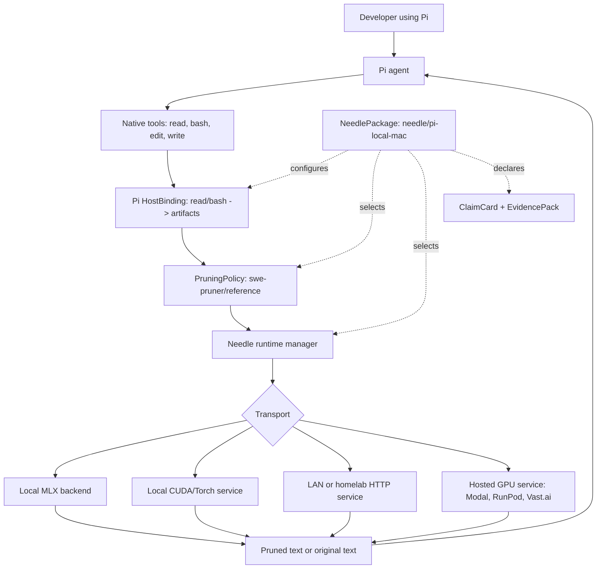
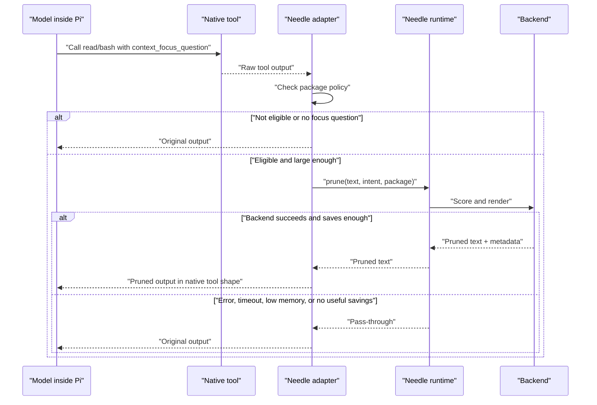
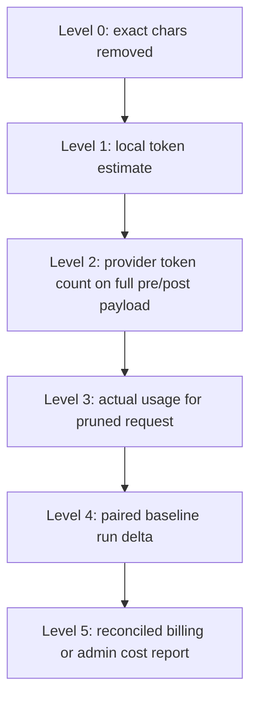

# Needle 1.0 PRD

Status: Draft
Date: 2026-06-22
Current project name: Hay
Target 1.0 name: Needle
Primary 1.0 host agent: Pi

## 1. Summary

Needle is a protocol-first pruning layer for coding agents.

Its core contract is intentionally small:

```text
prune :: text -> text' | text
```

The pruning layer stands between an agent tool and the model. A tool produces
text. Needle may return a smaller, task-relevant version of that text, or it may
return the original unchanged. Everything else is support structure:

- A `PruningPolicy` defines a falsifiable behavior claim.
- A `NeedlePackage` composes policy, host integration, compute, prompts/skills,
  accounting, lifecycle, and evidence into something a user can install.
- A host binding maps a real agent tool result into the package's text contract.
- A backend implements the package's required behavior.
- A runtime keeps expensive models observable and resident when useful.
- A transport decides whether the backend is local, LAN, hosted, or embedded.
- Accounting explains what was changed and how savings claims were calculated.

The 1.0 product should not be a benchmark harness. It should be a usable Pi
extension that people can install, observe, trust, and build on.

## 2. Why this exists

Agentic coding loops often feed large tool outputs back into expensive models.
The SWE-Pruner paper argues that task-aware pruning can reduce token usage while
preserving solve quality by asking the agent for a goal hint, then using a small
neural skimmer to keep relevant lines. The paper reports 23-54% token reduction
on agent tasks such as SWE-Bench Verified, with a headline result around 39-40%
total token savings on Mini-SWE-Agent plus Claude Sonnet 4.5.

Needle's product thesis:

If pruning works, it should become a platform layer rather than a one-off
benchmark trick. Mac users should be able to run it locally through MLX. CUDA
users should be able to run it locally, on a LAN box, or on hosted GPUs. Agent
authors should be able to add adapters. Backend authors should be able to
replace the scorer without rewriting the agent integration.

## 3. 1.0 definition

Needle 1.0 is ready when a developer can:

1. Install Needle as a Pi extension.
2. Open Pi and use normal tools.
3. See an honest status bar that explains whether Needle is down, cold,
   loading, ready, active, or degraded.
4. Use a SWE-Pruner-compatible default package for large `read` and `bash`
   outputs.
5. Run a local MLX backend on Apple Silicon, or point Needle at a pruning HTTP
   service.
6. Understand exactly what Needle claims about saved context, estimated tokens,
   and estimated dollars.
7. Turn Needle off or uninstall it without mysterious background processes or
   orphaned model files.

1.0 is not the point where every backend is optimal. It is the point where the
platform contract is stable, the default integration is useful, and the product
is honest enough to post publicly.

## 4. Non-goals

- Do not make the benchmark dashboard part of 1.0.
- Do not claim exact user dollar savings without paired or provider-billing
  evidence.
- Do not require Docker for Apple-local use.
- Do not make users understand MLX, CUDA, or SWE-Pruner internals to get value.
- Do not fork Pi's UX into a separate "Needle tool world" if native tools can be
  extended directly.
- Do not optimize the MLX backend before measuring the right bottlenecks.
- Do not make the platform depend on one hosted provider.

## 5. Product principles

### 5.1 Small essence, rich metadata

The essence is text in, text out. Metadata is useful for observability and
accounting, but it must not make the platform feel like a narrow implementation
of one paper.

Minimal contract:

```text
input:  text
output: text' | text
```

Practical contract:

```json
{
  "text": "large tool output",
  "intent": "What is the model looking for?",
  "package": "needle/pi-local-mac",
  "source": {
    "host": "pi",
    "tool": "read"
  }
}
```

```json
{
  "text": "pruned or original output",
  "changed": true,
  "reason": "pruned",
  "metrics": {
    "original_chars": 10000,
    "returned_chars": 4200,
    "original_tokens_est": 2500,
    "returned_tokens_est": 1050
  }
}
```

The simple function matters because future backends may not look like
SWE-Pruner. A backend might use AST structure, semantic search, lossy summaries,
compressed artifacts, or some other representation. The platform should allow
that as long as the agent receives a usable response.

### 5.2 Core, PruningPolicy, NeedlePackage

Needle needs a clear separation:

- Needle Core: the universal protocol, `prune :: text -> text' | text`.
- PruningPolicy: a host-neutral, versioned behavior contract for when text is
  eligible, what intent is required, how failure passes through, and which
  behavior recipe is being claimed.
- NeedlePackage: the installable/testable bundle that wires a policy into a
  host integration, prompts/skills, compute target, accounting, lifecycle, docs,
  claim card, and evidence pack.
- ArtifactKind: a package-local compatibility tag such as `file_text` or
  `process_output`; useful for bindings and fixtures, but not a universal
  ontology.
- HostBinding: host tool extraction and patching, such as Pi `read` and `bash`.
- Backend: an implementation of the package's required policy behavior.
- Runtime: how a backend stays alive, visible, and safe.
- Transport: where calls go.
- Accounting: how exact changes, token estimates, and price estimates are
  enriched and labeled.

This avoids Xeno's-paradox development, where every change gets us "closer" to
parity without defining what parity means.

The only platform law is the core protocol. `ArtifactKind` names and behavior
steps should be strict inside a package, but they should not become eternal
Needle-wide categories. A future summarizing, retrieval-based, compressed, or
opaque hosted pruner should still be valid if it accepts text, returns usable
replacement text or the original, fails open, and reports claims honestly.

Minimum policy example:

```yaml
schema: needle.pruning_policy.v1
id: swe-pruner/reference
version: 0.1
description: "Paper-parity SWE-Pruner behavior: explicit focus, line scoring, line-marker rendering, no AST expansion."
contract:
  input: text
  output: text
  failure: passthrough
artifact_kinds:
  - file_text
  - process_output
focus:
  field: context_focus_question
  required: true
  missing: passthrough
gates:
  min_chars: 500
claim_scope:
  ast_expansion: absent
```

Reference-policy implementation metadata can be more specific, but it remains
local to this policy/package:

```yaml
implementation:
  behavior_recipe:
    steps:
      - id: chunk
        kind: whole_document_overlap_chunker
        params:
          chunk_overlap_tokens: 50
      - id: score
        kind: swe_pruner_line_scorer
      - id: select
        kind: threshold_line_selector
        params:
          threshold: 0.4
          always_keep_first_frags: false
      - id: render
        kind: pruned_line_marker_renderer
        params:
          marker: "[pruned]"
```

`description` is human prose, not a field the product parses for behavior. The
falsifiable behavior lives in the contract, focus rules, gates, claim scope, and
the package's evidence pack. Internal tensor shapes, tokenizer choices, padding
strategy, and model paths belong to backend implementation docs.

A Pi binding maps host tools to package artifact kinds:

```yaml
schema: needle.host_binding.v1
id: pi/native-tools
version: 0.1
host: pi
tools:
  read:
    artifact_kind: file_text
    focus_param: context_focus_question
    text_extract: pi_text_blocks
    text_patch: replace_pi_text_blocks
  bash:
    artifact_kind: process_output
    focus_param: context_focus_question
    text_extract: pi_text_blocks_or_stdout
    text_patch: replace_pi_text_blocks_or_stdout
fallbacks:
  unsupported_result_shape: passthrough
```

A backend advertises what this package can rely on:

```yaml
schema: needle.backend.v1
id: code-pruner-mlx
implements:
  - policy: swe-pruner/reference
    capabilities:
      - focus_question
      - line_scores
      - whole_document_chunking
```

A `NeedlePackage` is the thing users and blind testers relate to:

```yaml
schema: needle.package.v1
id: needle/pi-local-mac
display_name: "Needle for Pi - Local Mac"
host_binding: pi/native-tools
pruning_policy: swe-pruner/reference
focus_contract:
  prompt_bundle: pi/context-focus-question@0.1
  missing_focus_behavior: passthrough
compute:
  default: local_mlx
  alternatives:
    - http_pruner
privacy:
  default: local_only
  remote_requires_explicit_endpoint: true
accounting:
  status: exact_chars
  async:
    - local_token_estimate
lifecycle:
  install: pi_extension
  status: /needle status
  doctor: /needle doctor
  uninstall: supported
claim_card: claims/pi-local-mac-swe-pruner-reference
evidence:
  - fixture_pack:swe-pruner-reference
  - demo_trace:pi-read-bash-local
```

The 1.0 config can compile down to today's simple runtime wire
`prune(text, intent)`. The policy and package do not need to travel over the
socket on every call before the manager supports that; the adapter/runtime setup
only needs to know which package is active.

Validation should be strict for what a package declares: known package schema,
known policy id, valid host binding, valid compute target, supported accounting
method, and resolvable evidence/claim-card references. If a package declares
required recipe steps, those steps must resolve to a package-local interface and
test fixture. Unknown required steps make that package invalid. Protocol
compatibility still only requires text in, text out, fail-open behavior, and
honest accounting.

This matters for AST repair. AST repair is not a universal policy field. It is
an optional behavior change that can add code back after pruning. That is why it
should not silently be part of a policy claiming paper parity, and why policies
should not all have a `support_recovery` key just because one package uses AST.

```text
swe-pruner/reference      # PruningPolicy: line pruning, no AST expansion
needle/soft-lamr          # PruningPolicy: SWE-Pruner scoring + Python AST expansion
pi/native-tools           # HostBinding: Pi read/bash mapped to artifact kinds
needle/pi-local-mac       # NeedlePackage: Pi binding + reference policy + local MLX
needle/default            # public package chosen for users
```

### 5.3 Fail open

Needle must never break the coding agent because pruning failed. When the
manager is down, a backend errors, a query is missing, the machine is under
memory pressure, or a request times out, the tool output passes through
unchanged and the status surface tells the truth.

### 5.4 Visible trust beats hidden cleverness

Users need to know whether Needle is working. The status bar, `/needle status`,
event logs, and per-session counters are not decoration. They are part of the
product contract.

## 6. User stories

### 6.1 Pi user on Apple Silicon

As a Pi user on a Mac, I install Needle, open Pi, and keep using normal `read`,
`write`, `edit`, and `bash` workflows. When large `read` or `bash` outputs come
back, Needle may prune them. I can see whether the model is loaded, active, or
failing open.

Acceptance:

- Pi extension installs from the repo or a package.
- Native `read` is extended, not replaced with a weird new tool name.
- The default Pi package maps `bash` output through the same policy as `read`.
- Status bar is present, responsive, and semantically true.
- `/needle status` or `/hay status` explains state and recent events.

### 6.2 Agent tool caller

As an agent, when I ask for a large tool output, I can include a
`context_focus_question` that tells Needle what I need from the output.

Acceptance:

- `context_focus_question` is a first-class tool parameter for prunable tools.
- Missing question means pass-through by default in the SWE-Pruner policy.
- Inferred query may exist as a fallback or experiment, but it is not the 1.0
  canonical behavior.

### 6.3 CUDA or homelab user

As a user with NVIDIA GPUs, I can run a pruning service locally, on a LAN
machine, or on a hosted GPU, then point Needle at its URL.

Acceptance:

- Needle can use an HTTP pruning backend.
- A local CUDA service and a remote hosted service satisfy the same protocol.
- The status surface shows transport/backend identity.
- Auth and privacy warnings are clear when using a non-local endpoint.

### 6.4 Backend contributor

As a backend author, I can implement a backend without understanding Pi internals.

Acceptance:

- Backend contract is documented.
- Required request and response fields are small.
- Optional metadata is documented but not mandatory.
- Backends can expose timing, memory, token, and policy/package metadata.

### 6.5 Public evaluator

As someone evaluating Needle, I can tell what was measured, what was estimated,
and what is unknowable without paired baselines.

Acceptance:

- Public claims distinguish chars removed, estimated tokens avoided, measured
  provider tokens, paired-run deltas, and billing deltas.
- Pricing formulas use current provider pricing tables.
- Claims do not imply exact savings for a user unless the evidence supports it.

## 7. SWE-Pruner reference policy

The reference 1.0 `PruningPolicy` should be named `swe-pruner/reference`.

This policy is the compatibility target for the paper and upstream repo. It is
not the only behavior Needle can ever support, but it should be the default
reference point because it gives the product a grounded claim.

### 7.1 Reference behavior

From the upstream implementation and examples:

- The agent provides a goal hint or focus question.
- Large command/file outputs are pruned against that question.
- If no query/focus question is provided, the output passes through.
- The service exposes a `/prune` style endpoint with `code`, `query`,
  `threshold`, and `chunk_overlap_tokens`.
- The reference examples prune `bash` output and `cat`/file-read output.
- The OpenHands example uses `context_focus_question` as the explicit field.
- The Python wrapper defaults include `threshold = 0.5`,
  `always_keep_first_frags = false`, and `chunk_overlap_tokens = 50`.
- Some benchmark configs used `threshold = 0.4`; Needle should document the
  chosen default and not hide it.

Source anchors for the policy:

- Paper abstract: task-aware pruning is guided by an "explicit goal"; this
  supports making `context_focus_question` first-class rather than inferred.
- Mini-SWE/OpenHands prompt examples: `context_focus_question` is optional and
  should be omitted when output does not need filtering; this supports
  pass-through when no focus question is supplied.
- Upstream examples: both shell output and file reads are prunable; this
  supports `process_output` plus `file_text` as default package artifact kinds,
  and the Pi binding maps those to `bash` and `read`.

### 7.2 Needle 1.0 reference policy and Pi package

Default reference policy:

```yaml
schema: needle.pruning_policy.v1
# Source anchor: the SWE-Pruner paper frames pruning as task-aware and guided by
# an explicit goal; the upstream Mini-SWE/OpenHands prompts expose that goal as
# an optional context_focus_question for large outputs.
id: swe-pruner/reference
version: 0.1
description: "Paper-parity SWE-Pruner behavior for large text artifacts."
contract:
  input: text
  output: text
  failure: passthrough
artifact_kinds:
  - file_text
  - process_output
focus:
  field: context_focus_question
  required: true
  missing: passthrough
gates:
  min_chars: 500
claim_scope:
  ast_expansion: absent
implementation:
  behavior_recipe:
    steps:
      - id: chunk
        kind: whole_document_overlap_chunker
        params:
          chunk_overlap_tokens: 50
      - id: score
        kind: swe_pruner_line_scorer
      - id: select
        kind: threshold_line_selector
        params:
          threshold: 0.4
          always_keep_first_frags: false
      - id: render
        kind: pruned_line_marker_renderer
        params:
          marker: "[pruned]"
```

Default Pi package:

```yaml
schema: needle.package.v1
id: needle/pi-local-mac
display_name: "Needle for Pi - Local Mac"
host_binding: pi/native-tools
pruning_policy: swe-pruner/reference
focus_contract:
  prompt_bundle: pi/context-focus-question@0.1
  missing_focus_behavior: passthrough
compute:
  default: local_mlx
  alternatives:
    - http_pruner
runtime: local_manager
accounting:
  status: exact_chars
  async: [tokens_removed_est, cost_equivalent_est]
claim_card: claims/pi-local-mac-swe-pruner-reference
evidence:
  - fixture_pack:swe-pruner-reference
```

The exact defaults can change after tests, but the policy and package files must
make them explicit. The user should not need to infer the pruning policy from
scattered adapter and backend environment variables.

If the public product wants AST repair by default, that should be a deliberate
Needle product policy:

```yaml
schema: needle.pruning_policy.v1
id: needle/soft-lamr
version: 0.1
extends: swe-pruner/reference
claim_scope:
  ast_expansion: python
implementation:
  behavior_recipe:
    steps:
      - id: score
        kind: swe_pruner_line_scorer
      - id: expand
        kind: python_ast_mask_expander
      - id: render
        kind: pruned_line_marker_renderer
```

It should not be silently folded into a policy that claims paper parity. The
older Soft-LaMR diagnostics are not clean proof that AST is necessary for the
final product because the pruning setup had goal-hint bugs at the time. Treat
them as failure-mode evidence: when the selector chooses useful internal lines,
AST expansion can restore enclosing classes/functions/imports, but it can also
return too much code. This policy must be retested with explicit goal hints
before becoming a public default.

### 7.3 Current gap on this branch

The current Pi branch is a strong first slice, but not yet the 1.0 package:

- It overrides Pi `read`.
- It does not yet prune Pi `bash`.
- It still infers the query from session text instead of requiring a
  `context_focus_question` parameter.
- It uses a `MIN_CHARS` default of 200 and `MIN_RATIO` default of 0.10 in the Pi
  adapter.
- It labels estimated saved chars as "tokens saved" in the status surface.
- The MLX wrapper currently enables repair by default, so strict
  `swe-pruner/reference` parity needs explicit repair-off configuration.
- The MLX backend processes whole-file chunks serially rather than using a
  batched, length-bucketed whole-file scoring path.

These are not signs that the project is a dud. They are the exact delta between
"native Pi read pruning exists" and "Needle 1.0 package is defined."

## 8. Architecture



### 8.1 Component responsibilities

Host binding / adapter code:

- Hooks or extends host-agent tools.
- Maps host tools to package artifact kinds.
- Extracts text from tool results.
- Supplies `context_focus_question`.
- Applies the pruned result back into the host's expected result shape.
- Records per-session counters.

PruningPolicy:

- Defines eligible artifact kinds.
- Defines when a query is required.
- Defines fail-open gates.
- Defines the behavior claim, optional behavior recipe, and render policy.

NeedlePackage:

- Composes host binding, policy, prompts/skills, compute target, runtime,
  accounting, lifecycle, claim card, and evidence pack.
- Is the thing blind testers install, inspect, and trust.

Runtime manager:

- Owns model residency.
- Serializes or schedules backend calls safely.
- Tracks sessions, leases, memory pressure, active requests, and events.
- Exposes status.

Backend:

- Implements the package's required policy behavior.
- Advertises capabilities such as line scores, whole-document chunking,
  black-box text pruning, or optional AST expansion.
- May be MLX, Torch/CUDA, upstream SWE-Pruner HTTP, a debug backend, or a
  third-party backend.
- Reports metadata when available.

Transport:

- Unix socket for local manager.
- HTTP for local/LAN/hosted services.

Do not invent another transport until a real host requires it. "Plugin
transport" is not a 1.0 concept; Pi should use the local manager/HTTP boundary,
and non-open-source agents can be considered later through MCP or host-native
tool bridges.

## 9. Pruning request lifecycle



## 10. Backend and transport strategy

### 10.1 Local MLX

MLX is the default Apple-local backend because it already fits the local product
shape and avoids asking Mac users to run Docker or own a CUDA GPU.

1.0 MLX requirements:

- Works from a Hay/Needle-owned model directory, not only the Hugging Face cache.
- Fails open under unsafe memory conditions.
- Exposes timing and memory stats.
- Supports whole-file chunking correctly.
- Does not silently change quality-critical defaults without recording them.

Performance risk:

Whole-file chunking means the backend may score many overlapping chunks. Prior
local profiling found that the forward path inside `_process_single_chunk`
dominates runtime, while tokenization and line aggregation are much smaller.
That points to batching and length bucketing as the next real performance move.

Required future MLX metrics:

```text
chunks
batches
actual_tokens
padded_tokens
forward_ms
host_sync_ms
render_ms
total_prune_ms
peak_rss_mb
memory_pressure
backend_load_ms
```

Near-term MLX optimization target:

```text
tokenize text
split into overlapping chunks
bucket chunks by similar length
run each bucket as an MLX batch
merge token scores back to original offsets
render lines
```

This should be treated as a performance gate for claiming "fast enough," not a
reason to block the protocol or Pi adapter work.

### 10.2 CUDA/Torch local service

CUDA users should not have to run the backend "remotely" in the sense of using
someone else's cloud. They should be able to run a local HTTP service on the
same machine, on a LAN GPU box, or on a workstation.

The upstream SWE-Pruner package already exposes a FastAPI service shape. Needle
should support a compatible HTTP backend instead of baking CUDA into the Pi
adapter.

1.0 target:

- `backend = http`
- `NEEDLE_PRUNER_URL = http://localhost:8000/prune`
- Optional bearer token.
- Same package/policy metadata as local MLX.

### 10.3 Hosted GPU services

Needle should treat hosted GPUs as deployment targets for the same protocol.
RunPod endpoints expose unique API URLs that accept HTTP requests and process
them with handler functions. Vast Serverless is designed for bursty inference
and manages GPU-backed workers behind endpoints/workergroups. Modal functions
autoscale containers and can scale to zero when idle.

The product requirement is not "support every platform directly." It is:

```text
Any platform that can run an HTTP service accepting prune requests can host a
Needle backend.
```

The 1.0 docs should include one blessed hosted example only if it is actually
tested. Otherwise, the PRD should describe the protocol and leave provider
recipes as post-1.0 guides.

A hosted recipe should look almost the same as a local GPU recipe:

```text
1. Start a pruning HTTP service.
2. Point Needle at its /prune endpoint.
3. Configure auth if the endpoint leaves localhost.
4. Verify /health and one sample prune.
5. Watch cost, cold start, and privacy separately from pruning quality.
```

The difference between "local CUDA box" and "RunPod/Vast/Modal worker" should
mostly be deployment, not product semantics.

## 11. Counterfactual savings and accounting

Savings are counterfactual because once Needle prunes a tool output, we do not
also send the unpruned request to the model in the same run. We can know what
Needle removed. We cannot know with certainty what a user's bill would have been
without Needle unless we run a paired baseline or compare provider billing data.

### 11.1 Metrics vocabulary

Use these names:

- `chars_removed`: exact local difference between original and returned text.
- `chars_returned`: exact returned text size.
- `compression_ratio_chars`: exact char ratio.
- `tokens_removed_est`: estimated token delta from a tokenizer or heuristic.
- `tokens_removed_provider_counted`: provider token count delta from full
  pre/post payloads when a provider count endpoint is available.
- `actual_pruned_run_usage`: tokens actually reported by the provider for the
  pruned request.
- `paired_baseline_delta`: difference between matched unpruned and pruned runs.
- `cost_equivalent_est`: estimated dollar delta using public pricing.
- `billing_delta`: actual billing/cost report delta when provider admin APIs or
  invoices make that possible.

Avoid this wording:

- "tokens saved" when only chars were divided by 4.
- "money saved" without a confidence level.
- "actual savings" without paired baseline or provider billing evidence.

The product does not need to put every caveat into the tiny status line. The
setup flow, README, CLI help, and detailed status view should explain that token
and dollar savings are counterfactual estimates unless paired or billing-backed.
After that, the status bar can stay short and humane.

### 11.2 Accounting methods



These are not all status-line labels. They are methods Needle can use in
different contexts.

Level 0: Exact chars.

- Always available when Needle sees original and returned text.
- Good for local observability.
- Not enough for pricing claims.

Level 1: Local token estimate.

- Useful for trend charts.
- Can use model tokenizer when available.
- Falls back to chars/4 only when clearly labeled as a rough estimate.

Level 2: Provider token count on full payload.

- Stronger than local tokenizer estimates.
- OpenAI's token counting endpoint accepts the same input shape as the Responses
  API and returns the exact count the model will receive, including formatting
  tokens.
- Anthropic's token counting endpoint supports structured messages, tools,
  images, and PDFs, but Anthropic says the count should be considered an
  estimate and may differ slightly from actual message creation.

Level 3: Actual usage for pruned request.

- Real token usage after pruning.
- Still not the counterfactual baseline.

Level 4: Paired baseline run delta.

- Best benchmark evidence.
- Requires same task, agent, model, tool policy, and environment.
- Still has stochastic variance.

Level 5: Billing/admin reconciliation.

- Best operational evidence.
- Anthropic's Usage and Cost Admin API can report token usage and cost
  breakdowns by model/workspace/service tier for organizations.
- Equivalent provider billing APIs should be used where available.

### 11.3 Token counter scenarios

Needle should support a small token-counter registry rather than hard-code one
provider path.

Local default:

- Use exact chars and a local token estimate.
- No extra network calls.
- Best for status bars and privacy-preserving local use.

Provider-counted demo:

- Send full pre/post payloads to a provider token-count endpoint.
- Useful for a polished demo, report, or benchmark artifact.
- Must warn that this sends prompt/tool content to the provider.

Benchmark mode:

- Capture actual provider usage from the model request.
- Compare paired baseline/pruned runs where possible.
- Use the same counter and pricing table for both sides.

Team billing mode:

- Reconcile against provider usage/cost APIs or invoices.
- Best for teams, not required for 1.0 local users.

Latency rule:

- Token counting must not sit in the pruning critical path.
- The adapter should return the pruned/original tool output as soon as the
  pruning decision is done.
- Token and price enrichment should run as a background accounting job attached
  to the prune event.
- The status line can update immediately from exact chars, then detailed status
  or reports can show token/cost fields after the counter finishes.
- Provider token-count endpoints should be opt-in because they add network
  latency and may send prompt/tool content to the provider.

Registry shape:

```yaml
token_counters:
  local_estimate:
    kind: heuristic
  openai:
    kind: provider_count_endpoint
  anthropic:
    kind: provider_count_endpoint
  custom:
    kind: command_or_http
```

### 11.4 Pricing formula

For a provider with uncached input, cached input, and output prices:

```text
estimated_input_cost =
  uncached_input_tokens * uncached_input_price
  + cached_input_tokens * cached_input_price

estimated_total_cost =
  estimated_input_cost
  + output_tokens * output_price
  + tool_or_container_costs
```

For counterfactual avoided input:

```text
estimated_avoided_input_cost =
  avoided_uncached_input_tokens * uncached_input_price
  + avoided_cached_input_tokens * cached_input_price
```

The difficult part is knowing which avoided tokens would have been uncached
versus cached in the unpruned run. Prompt caching makes the billing
counterfactual harder because cache hits depend on provider routing, stable
prefixes, cache retention, request rate, and prompt structure.

OpenAI currently publishes separate GPT-5.5 prices for input, cached input, and
output tokens. Anthropic also publishes separate base input, cache write, cache
hit/refresh, and output prices. Needle should fetch or version pricing tables in
docs/build tooling rather than hard-code stale marketing claims.

### 11.5 Product rule

Needle status surfaces should show exact local metrics first:

```text
needle · ready · 42k chars trimmed · 7 prunes
```

Detailed views may show:

```text
tokens avoided: 10.5k
input cost avoided: $0.05
method: chars/4 estimate, not paired baseline
```

The method label belongs in detailed status, reports, benchmark artifacts, setup
docs, and CLI help. It should not make the status line feel like legal copy.

The hero metric for public claims should be:

```text
avoids X% input context on measured workloads while preserving solve rate within Y
```

Dollar claims should be secondary and explicitly estimated unless backed by
provider cost reports or paired API usage.

### 11.6 Claim cards

Every public package should ship a claim card. The claim card is the bridge
between engineering config and tester trust: it tells people what the package
claims, what evidence supports the claim, and what they must not infer.

Example:

```yaml
schema: needle.claim_card.v1
id: claims/pi-local-mac-swe-pruner-reference
package: needle/pi-local-mac
policy: swe-pruner/reference
claim: "Task-aware pruning for large Pi read/bash outputs with explicit focus questions."
evidence_level: demo_fixture
tested:
  host: pi
  tools:
    - read
    - bash
  compute: local_mlx
  policy: swe-pruner/reference
metrics:
  exact:
    - original_chars
    - returned_chars
    - chars_removed
  estimates:
    - tokens_removed_est
known_limits:
  - "Token and dollar savings are estimates unless paired or billing-backed."
  - "Missing context_focus_question passes through."
  - "Local MLX performance depends on machine memory and model residency."
must_not_claim:
  - "Exact user dollar savings."
  - "Paper parity if AST expansion is enabled."
  - "Support for tools not listed in the package."
privacy_notes:
  default: "Tool text stays on the local Mac."
  remote_compute: "Remote endpoints may receive tool text."
```

The status line should stay short. The claim card belongs in docs, `/needle
doctor`, benchmark artifacts, and tester handoff material.

## 12. Status ontology

The glyph and word should reflect real runtime state, not vibes.

States:

- `down`: no manager or backend endpoint reachable.
- `cold`: runtime reachable, model not resident, no load in progress.
- `loading`: model load in progress.
- `ready`: model resident and idle/available.
- `active`: prune currently in flight.
- `degraded`: runtime reachable, but backend is fake/fallback/erroring.

Motion grammar:

- `down`, `cold`, `degraded`: static or breathing glyphs because they are stable
  conditions.
- `loading`, `ready`, `active`: spinner-style glyphs because they imply liveness.

Example status lines:

```text
- needle · down · manager unreachable
· needle · cold · mlx · model not resident
x needle · degraded · backend unavailable
⠙ needle · loading · mlx · first load
⠿ needle · ready · mlx · 42k chars trimmed · 7 prunes
⠋ needle · active · bash · 28k -> 2.4k
```

Implementation implication:

- `active` should mean in-flight pruning, not "a prune happened recently."
- Recent activity belongs in counters/events.
- The manager should eventually expose explicit state and active operation
  metadata so every adapter does not infer state from timeouts.

## 13. Pi adapter scope

Pi is the 1.0 agent target because it is open source and has a small native
tool surface. That makes it realistic to extend native tools rather than route
the model through separate Needle-named tools.

1.0 Pi requirements:

- Package install works through Pi's extension/package flow.
- `read` is extended with pruning.
- `bash` is extended with pruning.
- Prunable tools accept `context_focus_question`.
- Missing focus question passes through.
- The status bar renders with system fonts/colors provided by Pi.
- `/needle status` reports runtime state, backend identity, package, policy,
  counters, model dir, source checkout, and recent events.
- `/needle doctor` reports install/source identity, package version, policy id,
  prompt/skill bundle versions, compute target, privacy mode, and claim card.

The model should still feel like it is using normal Pi. Needle should be a layer
under the tools, not a second agent UX.

## 14. Public launch requirements

Before LinkedIn/Twitter/public tester launch:

1. Installation path:
   - One clear install command.
   - One uninstall command.
   - Model directory explained.
2. Demo path:
   - A small repo or fixture where Needle visibly prunes a large read/bash
     output.
   - Status bar visible.
   - No benchmark dashboard dependency.
3. Evidence path:
   - One small measured before/after trace.
   - Exact chars removed.
   - Estimated tokens avoided with confidence label.
   - Package claim card included.
   - No overclaiming on dollars.
4. Contributor path:
   - Backend protocol documented.
   - HTTP backend documented.
   - PruningPolicy documented.
   - NeedlePackage manifest documented.
5. Safety path:
   - Fail-open behavior documented.
   - Local vs remote privacy implications documented.
   - Background process lifecycle documented.

## 15. Acceptance gates

### 15.1 Installability gate

- Fresh Pi install can load Needle.
- `/needle doctor` confirms the active checkout/package.
- Model files live under Needle/Hay-owned directories.
- Uninstall instructions remove extension wiring and model files.

### 15.2 Policy/package trust gate

- `swe-pruner/reference` exists as a named `PruningPolicy`.
- The policy applies to package artifact kinds such as `file_text` and
  `process_output`, not host tool names.
- A Pi host binding maps `read` and `bash` to those artifact kinds.
- A `NeedlePackage` such as `needle/pi-local-mac` composes the binding, policy,
  compute target, accounting, lifecycle, claim card, and evidence pack.
- `context_focus_question` is first-class.
- No question means pass-through.
- Chunking, overlap, threshold, and render marker are explicit.
- The reference policy has no AST expansion step.
- Package validation rejects unresolved required policy, binding, compute,
  accounting, evidence, or package-local step references.

### 15.3 Runtime trust gate

- Status states are semantically true.
- Manager exposes enough state for adapters to avoid guessing.
- Events include prune, pass-through reason, backend load, backend error, and
  eviction.
- Low-memory behavior is visible, not silent.

### 15.4 Accounting gate

- Status uses chars, not fake tokens.
- Token estimates have confidence labels.
- Provider token counting integration is designed, even if not mandatory for
  local-only use.
- Public claims can be traced to evidence.

### 15.5 Performance gate

- MLX whole-file scoring records chunk/batch/timing metrics.
- Large read/bash outputs do not make the laptop feel broken without a visible
  reason.
- The docs tell users when to prefer local MLX, local CUDA, LAN HTTP, or hosted
  GPU.

## 16. Open questions

1. How should the Hay -> Needle rename be sequenced before public release?
   Decision so far: the rename should happen before public 1.0/tester launch,
   not after people start installing it.
2. Which exact `swe-pruner/reference` defaults are paper/reference defaults, and
   which are benchmark-config defaults? The answer should live in the policy and
   package claim card, not in scattered env vars.
3. Which public package should be the default, and which policy does it select:
   `swe-pruner/reference`, `needle/soft-lamr`, or another tested policy? This
   decides whether Python AST expansion is absent for parity or present as a
   Needle product choice. MLX, CUDA, and HTTP are compute choices, not policy
   names.
4. What user-facing token counter choices should ship first: local estimate,
   OpenAI provider count, Anthropic provider count, custom counter registry, or
   design-only?
5. Do we ship a tested hosted GPU recipe in 1.0, or document only the HTTP
   protocol and leave provider-specific recipes post-1.0?
6. How much MLX batching is enough for public testers? The likely gate is
   "decent parallelism plus timing/padding metrics," not perfect Apple-runtime
   optimization.

## 17. Proposed immediate work order

1. Convert this PRD into issues.
2. Add a `swe-pruner/reference` PruningPolicy document/config.
3. Add `pi/native-tools` HostBinding and `needle/pi-local-mac` NeedlePackage
   configs.
4. Add a package claim card and fixture/evidence pack for the demo path.
5. Change the status line from "tokens saved" to exact chars trimmed; put token
   method details in `/needle status`, reports, and docs.
6. Add explicit `context_focus_question` to Pi `read`.
7. Add Pi `bash` pruning under the same policy.
8. Tighten status ontology so `active` means in-flight.
9. Add backend timing/whole-file chunk metrics.
10. Add HTTP backend transport compatible with upstream SWE-Pruner service.
11. Re-run small structural diagnostics with explicit goal hints, comparing
   `swe-pruner/reference` and `needle/soft-lamr`.
12. Re-run one demo trace.

## 18. Sources

- SWE-Pruner paper: https://arxiv.org/html/2601.16746v1
- SWE-Pruner GitHub repository: https://github.com/Ayanami1314/swe-pruner
- Upstream local checkout inspected at `/Users/enoch/repos/swe-pruner`
- OpenAI token counting docs: https://developers.openai.com/api/docs/guides/token-counting
- OpenAI prompt caching docs: https://developers.openai.com/api/docs/guides/prompt-caching
- OpenAI API pricing: https://openai.com/api/pricing/
- Anthropic token counting docs: https://platform.claude.com/docs/en/build-with-claude/token-counting
- Anthropic pricing docs: https://platform.claude.com/docs/en/about-claude/pricing
- Anthropic Usage and Cost API docs: https://platform.claude.com/docs/en/manage-claude/usage-cost-api
- RunPod serverless endpoint docs: https://docs.runpod.io/serverless/endpoints/overview
- Vast.ai serverless docs: https://docs.vast.ai/guides/serverless
- Vast.ai serverless architecture docs: https://docs.vast.ai/guides/serverless/architecture
- Modal scaling docs: https://modal.com/docs/guide/scale
- Modal Function docs: https://modal.com/docs/sdk/py/latest/modal.Function
