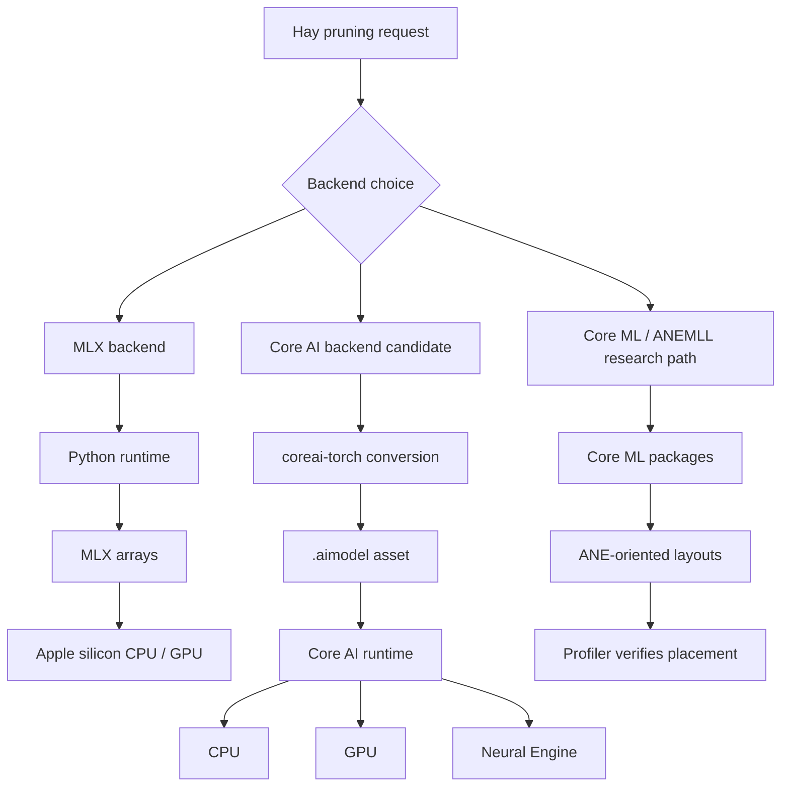
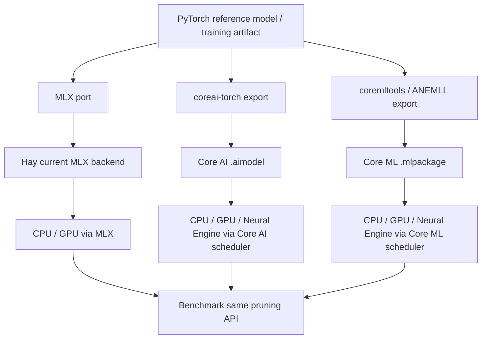
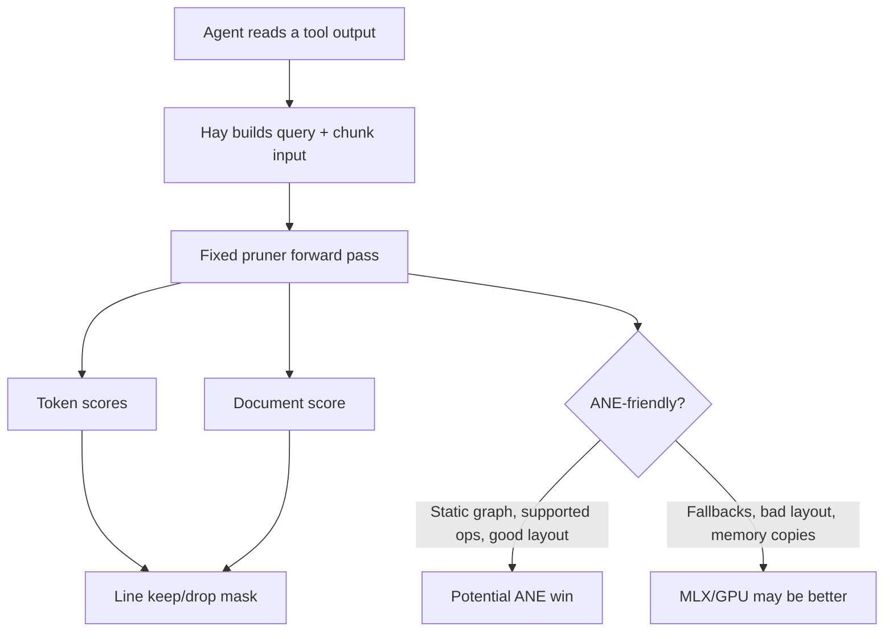
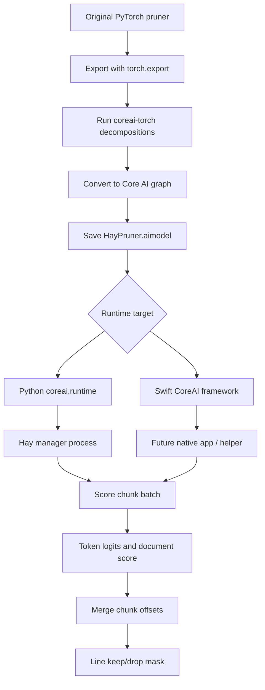
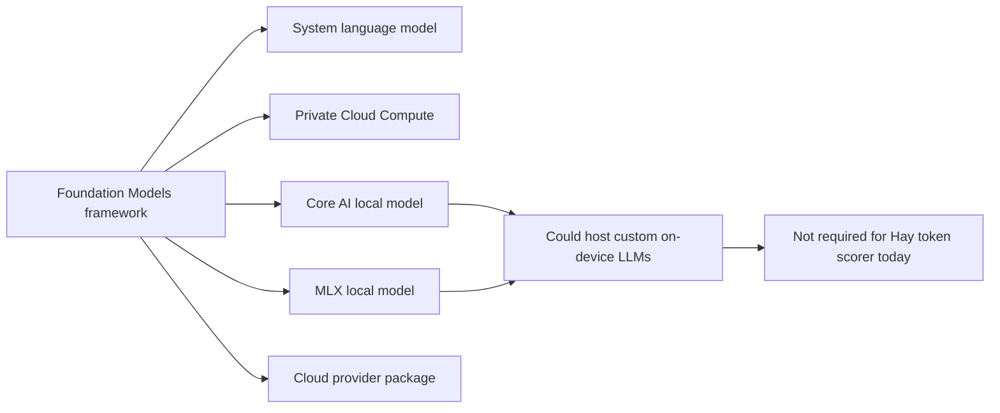
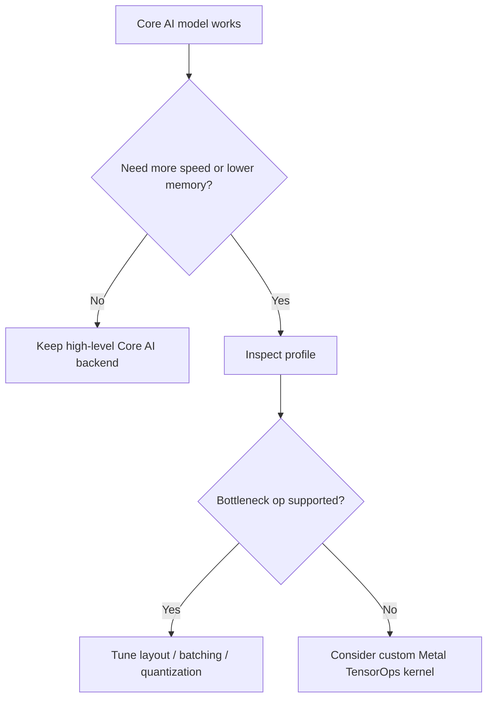
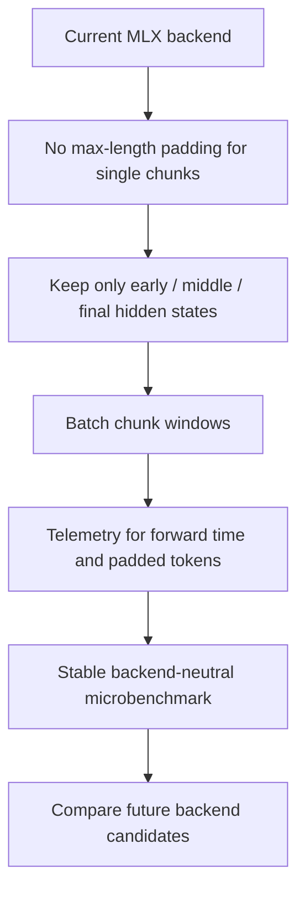
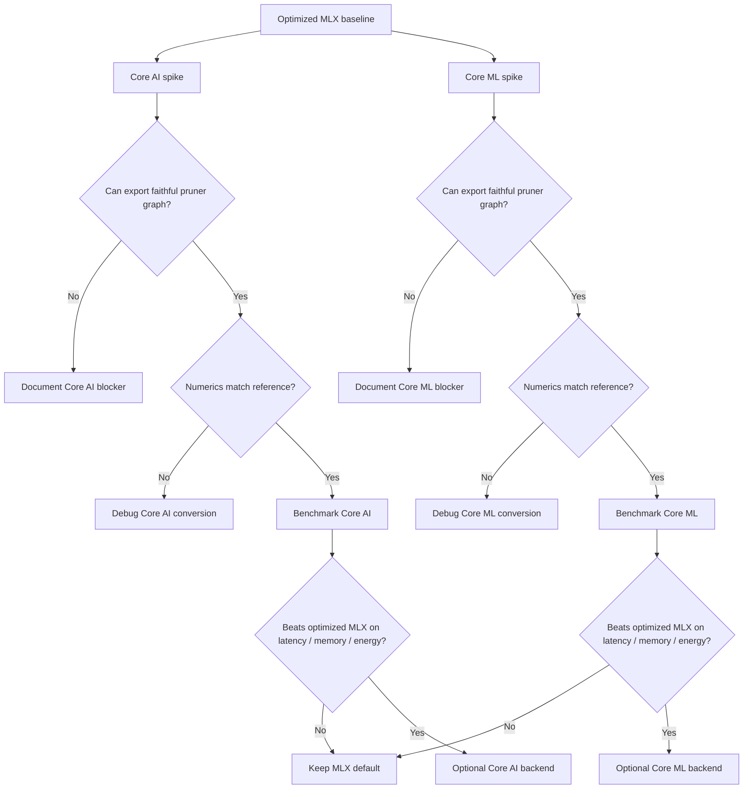

# Apple On-Device Backend Notes

Last researched: 2026-06-19

This note captures the side-thread research on modern Apple AI deployment paths
and what they might mean for Hay. It is not an implementation decision yet. The
main practical takeaway is that we do not yet know which Apple backend is best
for Hay's pruner. There are three real lanes to compare:

- The current MLX backend, which is what Hay already uses and must be optimized
  regardless.
- A future Core AI backend, which is interesting because Apple is positioning it
  as the modern on-device AI deployment stack across CPU, GPU, and Neural
  Engine.
- A Core ML backend, potentially helped by ANEMLL/CoreML tooling, which is the
  more mature public route to Neural Engine execution but may be less natural
  for Hay's custom scorer.

## Executive Summary

Hay's current Mac-native pruner path is the MLX backend. That is the right
immediate place to fix performance, because the current bottlenecks are local
and obvious: padding every chunk to the maximum sequence length, retaining too
many hidden states, and processing chunk windows serially.

Core AI changes the medium-term roadmap, not the immediate one. Apple now has a
beta framework called Core AI for running AI models on Apple silicon across CPU,
GPU, and Neural Engine. It has Python tooling for conversion, a Swift runtime
API, Python runtime support through `coreai.runtime`, model specialization and
caching, ahead-of-time compilation, Instruments profiling, and support for
stateful execution. That makes it worth investigating, but not assuming.

Core ML is still a serious third option. It is older and more mature than Core
AI, and it is already the public framework most associated with Neural Engine
deployment. The tradeoff is that Core ML may be awkward for Hay's custom
hidden-state/token-scorer path, and any claimed ANE benefit must be verified
with profiling rather than assumed.

The likely path is:

1. Fix the MLX backend first.
2. Add a small backend-neutral pruner microbenchmark.
3. Try a Core AI export of the original PyTorch pruner.
4. Try a Core ML / ANEMLL export if the model shape looks compatible.
5. Compare MLX vs Core AI vs Core ML on the same chunk-scoring inputs.
6. Only then decide whether any non-MLX backend is worth carrying.

## Modern Apple AI Stack



Core AI and Core ML should be treated as backend candidates, not replacements
for MLX today. Core AI is beta and depends on the new Apple OS/toolchain
generation. Core ML is more mature but may be harder to make faithful to Hay's
current scorer. The important thing is that these are public Apple paths; they
are preferable to direct private ANE reverse engineering if they can run the
right graph efficiently.

## Backend Options

| Backend | What it is | Why it might fit Hay | Main risks | Status |
| --- | --- | --- | --- | --- |
| MLX | Apple's Python-first array and neural-network stack for Apple silicon. Hay's current backend uses this path. | Already works in the repo, runs today on the user's Mac, easiest path for immediate performance fixes. | Current implementation wastes memory/compute; MLX targets CPU/GPU, not the Neural Engine; long-output chunking increased real work. | Current backend. Optimize first. |
| Core AI | Apple's new beta framework for modern on-device AI model deployment across CPU, GPU, and Neural Engine. | Potential official future path for specialized, compiled, repeated inference; has Python conversion/runtime hooks and AOT compilation. | OS/toolchain 27+ beta, export feasibility unknown, actual ANE placement must be profiled. | Interesting future backend candidate. |
| Core ML | Apple's mature public ML deployment framework, historically the main public path to Neural Engine execution. | More mature than Core AI, existing CoreML tooling, ANEMLL ecosystem, possible broader near-term Apple deployment path. | May be less natural for custom transformer/scorer internals; Core ML can silently schedule ops away from ANE; conversion may require architecture changes. | Third option to benchmark, not a default. |

## How The Options Relate

MLX, Core AI, and Core ML are not just different switches for the same runtime.
They sit at different levels.



MLX is a runtime/backend, not automatically an interchange format for Core AI or
Core ML. For Hay, "MLX backend" means the code path we have now. A Core AI or
Core ML backend would probably start from the original PyTorch model or a
carefully reconstructed export graph, then be wrapped behind the same Hay
`PrunerBackend` contract.

## Why The Neural Engine Might Fit

The Apple Neural Engine is interesting for Hay because Hay's pruner is not a
general coding model. It is a repeated inference scorer:

- It receives query text plus a tool-output chunk.
- It runs a fixed model forward pass.
- It returns token scores and a document score.
- It does not generate long text.
- It does not need sampling, tool calling, or open-ended decoding.

That shape might suit ANE if the pruner can be expressed as a static,
specialized graph with supported operations and efficient memory layout.



The ANE hypothesis is therefore:

```text
Hay's pruner may be a good ANE workload because it is compact, repeated,
inference-only, and structured.
```

The counter-hypothesis is:

```text
The pruner may still run better on optimized MLX/GPU because transformer
scoring can be memory-bandwidth bound, and unsupported operations or bad tensor
layouts can erase the Neural Engine advantage.
```

So the question is not "is ANE generally better?" The question is:

```text
Can this exact pruner graph run mostly on ANE, with faithful scores, lower
latency, lower memory pressure, or better energy behavior than optimized MLX?
```

## Source Findings

### WWDC26 Machine Learning Guide

Apple's WWDC26 machine learning guide describes four relevant lanes:

- Foundation Models framework: Swift API for Apple's on-device model, Private
  Cloud Compute models, and custom providers through a Language Model protocol.
- Core AI: new framework for bringing your own models on-device, with Swift API,
  Python tooling, specialization, caching, zero-copy data paths, stateful
  execution, and CPU/GPU/Neural Engine execution.
- MLX: open source array framework for Apple silicon, now tied to Metal 4 and
  GPU Neural Accelerators for newer hardware.
- Evaluations: framework for testing prompts and AI feature behavior.

Source: [WWDC26 Machine Learning guide](https://developer.apple.com/wwdc26/guides/machine-learning/)

### Core AI

Apple describes Core AI as a beta framework to run AI models in apps on Apple
silicon. It supports model preparation, integration, debugging, profiling,
specialization, caching, and ahead-of-time compilation.

Relevant API objects:

- `AIModel`
- `AIModelAsset`
- `InferenceFunction`
- `InferenceValue`
- `NDArray`
- `ComputeStream`
- `AIModelCache`
- `ComputeUnitKind`
- `SpecializationOptions`

Source: [Core AI documentation](https://developer.apple.com/documentation/CoreAI)

### Core AI Conversion Shape

The "Meet Core AI" session shows a PyTorch export and conversion path. The
important part for Hay is that the source model can start as PyTorch, then move
through `coreai-torch` into a `.aimodel` asset.

```python
import torch
import coreai_torch

pt_model = SnakeTransformer().load_checkpoint("snake.pt")
example = torch.randn(1, 5, 16)

seq_len = torch.export.Dim("seq_len", min=1, max=256)
exported = torch.export.export(
    pt_model,
    args=(example,),
    dynamic_shapes={"features": {1: seq_len}},
)
exported = exported.run_decompositions(coreai_torch.get_decomp_table())

ai_program = coreai_torch.TorchConverter().add_exported_program(
    exported,
    input_names=["features"],
    output_names=["logits"],
).to_coreai()

ai_program.save_asset("SnakeTransformer.aimodel")
```

For Hay, the analogous experiment would be:

```python
exported = torch.export.export(
    pytorch_pruner,
    args=(input_ids, attention_mask),
    dynamic_shapes={"input_ids": {1: seq_len}, "attention_mask": {1: seq_len}},
)

ai_program = coreai_torch.TorchConverter().add_exported_program(
    exported,
    input_names=["input_ids", "attention_mask"],
    output_names=["token_logits", "score_logits"],
).to_coreai()

ai_program.save_asset("HayPruner.aimodel")
```

That snippet is a sketch. The actual feasibility gate is whether Hay can export
the original PyTorch backbone plus scorer cleanly, including the custom
compression head and CRF/Viterbi path if enabled.

Source: [Meet Core AI](https://developer.apple.com/videos/play/wwdc2026/324/)

### Core AI Runtime Shape

The Swift runtime path in the session is:

```swift
import CoreAI

let model = try await AIModel(contentsOf: modelURL)
let mainFunction = try model.loadFunction(named: "main")!

let inputNDArray = nextInput()
var outputs = try await mainFunction.run(inputs: ["input": inputNDArray])

guard let outputNDArray = outputs.remove("output")?.ndArray else {
    throw ModelError.missingOutput
}
```

The Python side matters more for Hay. The `coreai-core` docs say the Python
package can build models with `coreai.authoring` and run existing `.aimodel`
files with `coreai.runtime`.

Possible Hay shape:

```python
from coreai.runtime import AIModel

class CoreAIPrunerBackend:
    def __init__(self, model_path: str):
        self.model = AIModel.load(model_path)
        self.function = self.model.load_function("main")

    async def score_batch(self, input_ids, attention_mask):
        result = await self.function({
            "input_ids": input_ids,
            "attention_mask": attention_mask,
        })
        return result["token_logits"], result["score_logits"]
```

This is also a sketch. The actual API names should be verified against the
installed `coreai-core` package when this becomes implementation work.

Source: [coreai-core docs](https://apple.github.io/coreai-torch/main/coreai-core/)

## Core AI Backend Candidate Flow



## Ahead-Of-Time Compilation

Core AI models must be specialized for the specific device before inference.
Apple says this happens automatically when creating an `AIModel`, but large
models can have a first-load delay. The `coreai-build` tool can compile a
`.aimodel` into per-architecture `.aimodelc` assets ahead of time.

```bash
xcodebuild -downloadComponent MetalToolchain

xcrun coreai-build compile HayPruner.aimodel \
  --platform macOS \
  --min-deployment-version 27.0 \
  --output compiled/
```

This would matter for a shipped Hay/Needle distribution because the model could
be prepared before the user asks the pruner to do work.

Source: [Compiling Core AI models ahead of time](https://developer.apple.com/documentation/CoreAI/compiling-core-ai-models-ahead-of-time)

## Foundation Models Relevance

The Foundation Models framework is adjacent, not the immediate backend for Hay's
scorer. It matters because Apple is standardizing a `LanguageModel` /
`LanguageModelExecutor` protocol where Apple's model, Private Cloud Compute,
Core AI models, MLX models, and cloud providers can be called through the same
session API.

That could matter later if Hay wants to expose itself as a model/provider or if
Needle wants a native macOS integration. It is not the immediate path for the
token-scoring pruner.



Source: [Bring an LLM provider to the Foundation Models framework](https://developer.apple.com/videos/play/wwdc2026/339/)

## Metal TensorOps And Quantization

Apple's WWDC26 Metal TensorOps session is relevant to future low-level work, not
the first Core AI spike. It shows:

- Quantized tensor data types in Metal tensor APIs.
- Multi-plane tensors that carry quantized data plus scale factors.
- TensorOps for quantized matrix multiplication.
- FlashAttention-style custom kernels.
- Integration of custom Metal operations into Core AI through Python tooling.

For Hay, this suggests a later optimization lane:



Source: [Optimize custom machine learning operations with Metal tensors](https://developer.apple.com/videos/play/wwdc2026/330/)

## ANE And Core ML Context

Apple's older ANE transformer article is still useful because it explains the
shape constraints that make transformers efficient on ANE:

- Prefer ANE-friendly 4D channels-first layout: `[batch, channels, 1, sequence]`.
- Replace many `Linear` layers with `Conv2d` equivalents where appropriate.
- Split attention heads into smaller chunks.
- Avoid reshape and transpose memory copies.
- Increase batch size or reduce parameter size when bandwidth-bound.

This maps onto Hay's chunking work. Hay should batch chunks before chasing ANE
directly, because Apple explicitly notes that batch size can help bandwidth-bound
transformer inference.

Source: [Deploying Transformers on the Apple Neural Engine](https://machinelearning.apple.com/research/neural-engine-transformers)

## ANEMLL And Profiling

ANEMLL is a community project for converting Hugging Face LLMs to CoreML and
running them on the Apple Neural Engine. The most useful parts for Hay are not
necessarily the runtime itself, but the project ecosystem:

- `anemll-profile`: CLI profiler for CoreML models that reports which ops land
  on ANE vs CPU vs GPU and why fallbacks happen.
- `anemll-bench`: benchmarks real ANE, GPU, and CPU throughput.

These may be useful when comparing Core ML / Core AI / MLX behavior, especially
if Xcode profiling is too GUI-heavy for benchmark automation.

Source: [ANEMLL](https://www.anemll.com/)

## Fix Current MLX Backend First

Core AI and Core ML are interesting directions, but neither should distract from
the current backend. The chunked pruner path needs optimization because
correctness increased the amount of real work being done. Old Hay looked faster
partly because it did not score enough of long tool outputs.

Near-term fixes:

1. Stop padding single chunks to `max_length`.
2. Capture only hidden states needed by the scorer.
3. Batch chunk windows with a small configurable batch size.
4. Track real forward cost:
   - `actual_forward_tokens`
   - `padded_forward_tokens`
   - `chunk_batches`
   - `prune_ms`
   - `forward_ms`
   - memory pressure before and after prune calls



This work is valuable even if Core AI or Core ML later wins. It gives Hay a
usable backend today, reduces laptop pressure for current users, and creates the
measurement harness needed to judge any replacement backend fairly.

## Suggested Decision Gates

Do not decide based on vibes. Decide by gates:



Minimum benchmark evidence for any backend spike:

- Same model weights.
- Same query and tool-output inputs.
- Same chunk policy.
- Same threshold and line mask renderer.
- Token-score correlation against the reference path.
- Wall-clock latency.
- Peak memory.
- Device support and first-run specialization cost.
- Hardware placement profile, especially whether work lands on ANE or falls
  back to CPU/GPU.

## Working Hypothesis

The best product path is not known yet. The current working hypothesis is:

```text
Default today:
  Optimized MLX backend.

Required next:
  Performance fixes for the current MLX backend.

Experimental:
  Core AI backend if PyTorch export, Python runtime, and hardware placement are viable.

Experimental:
  Core ML backend if conversion/profiling show faithful scoring and real ANE benefit.

Future:
  AOT-compiled Core AI or Core ML assets for supported Macs, if either backend wins.

Research only:
  Private ANE APIs.
```

The important psychological reframe is that the laptop pain does not mean the
project is doomed. It means the honest chunked implementation has revealed the
real inference cost. The immediate job is to make the current MLX backend less
wasteful. The medium-term job is to determine, with measurements, whether Core
AI or Core ML can do better for this specific token-scoring workload.

## Practical Probe: 2026-06-19

This was a first local reality check against the current Hay checkout and the
user's Mac. It should be treated as directional, not a benchmark result.

### Local Environment

- macOS: 26.5.1, arm64.
- Python through `uv run`: 3.13.7.
- Installed in Hay's uv environment: `mlx`, `mlx_lm`, `transformers`,
  `huggingface_hub`.
- Missing in Hay's uv environment: `coreai`, `coreai_torch`, `coremltools`,
  `torch`.
- Xcode status: only Command Line Tools are active; `xcodebuild -version`
  reports that full Xcode is not selected.
- `coreai-build` is not currently available through `xcrun`.
- Current Hay `sysmem.memstat()` at probe start: normal pressure with about
  2.4-2.9 GB available, which is below Hay's default `HAY_MIN_FREE_MB=3072`.

Implication: this machine can profile the current MLX backend today, but it is
not yet ready for a Core AI export/runtime spike. That lane first needs the
right Apple beta toolchain, Python packages, and probably a PyTorch reference
model/export surface.

### Runtime Logs

`uv run -m pruner status --events 20` showed no live manager. Recent status was
cold/down, with recent events dominated by low-memory passthroughs.

Current `~/.hay/events.jsonl` aggregate:

- 209 total events.
- 155 passthrough events, all reason `low-memory`.
- 20 lease events, 21 release events, 6 stale step-asides.
- 7 model load events and 0 model evict events in the current log.
- Low-memory passthroughs covered about 431,625 input characters total, with a
  max single passthrough of 26,466 chars and an average of about 2,785 chars.

Implication: the active pain is not just forward-pass speed. The product path is
also gated by safe cold-load behavior, memory pressure, and clear operator
telemetry. Any future Core AI/Core ML backend needs to improve that story, not
only win a synthetic latency test.

### MLX Microprofile

Probe setup:

- Direct backend construction, bypassing the manager, with `HAY_MLX_LIGHT=1`.
- `HAY_CHUNK_OVERLAP_TOKENS=16`.
- `HAY_MLX_CLEAR_CACHE_AFTER_PRUNE=1`.
- Synthetic Python functions as input.
- No claims about quality or real SWE-bench behavior.

Small 80-function probe at `HAY_MAX_LENGTH=512`:

- Import time: about 1.3s.
- Backend load after import: about 0.6s.
- RSS after load: about 252 MB.
- First prune: about 2.7s, 5 chunks, 1,820 original tokens.
- Second prune: about 2.0s, same 5 chunks.
- RSS after inference: about 1.28 GB.
- System memory moved from normal pressure to warning during the prune.

Longer 180-function sweep with `HAY_REPAIR=0`:

| max_length | chunks | seconds | original_tokens | model_input_tokens | estimated padded forward tokens |
| --- | ---: | ---: | ---: | ---: | ---: |
| 512 | 18 | 14.542 | 7,340 | 9,052 | 9,216 |
| 1024 | 8 | 11.408 | 7,340 | 8,092 | 8,192 |
| 2048 | 4 | 8.924 | 7,340 | 7,708 | 8,192 |
| 4096 | 2 | 9.709 | 7,340 | 7,516 | 8,192 |

The sweep suggests the immediate latency cost is dominated by serial chunk
passes through `_process_single_chunk`, not by tokenizer or line-aggregation
overhead. `max_length=2048` was fastest in this tiny sample, but pruning
aggressiveness changed materially across max lengths, so this cannot be treated
as a pure performance knob.

`cProfile` on a 120-function, 3-chunk, `max_length=2048` prune:

- Total: about 6.19s.
- `_process_single_chunk`: about 6.13s cumulative.
- NumPy conversion from MLX outputs: about 0.64s cumulative.
- Tokenization, chunk splitting, merge, and line aggregation were small by
  comparison.

Implication: the next MLX work should instrument forward time, padded tokens,
actual code tokens, chunk count, and host sync separately. Batching chunk
windows is likely a higher-leverage next experiment than polishing tokenizer or
line mapping code.

### Next Practical Steps

1. Add timing fields to backend stats:
   - `chunk_build_ms`
   - `forward_ms`
   - `decode_ms`
   - `host_sync_ms`
   - `line_aggregate_ms`
   - `padded_forward_tokens`
   - `actual_forward_tokens`
2. Make a backend-neutral local microbenchmark that records those fields for a
   fixed set of synthetic and real tool-output fixtures.
3. Run a same-input quality smoke test across `HAY_MAX_LENGTH` values before
   changing defaults.
4. Prototype batched chunk windows in MLX after the timing fields exist.
5. Only start Core AI/Core ML implementation after the Apple toolchain and
   export packages are available locally.

## Source Index

- [WWDC26 Machine Learning guide](https://developer.apple.com/wwdc26/guides/machine-learning/)
- [Meet Core AI](https://developer.apple.com/videos/play/wwdc2026/324/)
- [Core AI documentation](https://developer.apple.com/documentation/CoreAI)
- [Compiling Core AI models ahead of time](https://developer.apple.com/documentation/CoreAI/compiling-core-ai-models-ahead-of-time)
- [coreai-core docs](https://apple.github.io/coreai-torch/main/coreai-core/)
- [coreai-torch supported ATen ops](https://apple.github.io/coreai-torch/main/api/supported-aten-ops.html)
- [apple/coreai-models](https://github.com/apple/coreai-models)
- [Bring an LLM provider to the Foundation Models framework](https://developer.apple.com/videos/play/wwdc2026/339/)
- [Optimize custom machine learning operations with Metal tensors](https://developer.apple.com/videos/play/wwdc2026/330/)
- [Deploying Transformers on the Apple Neural Engine](https://machinelearning.apple.com/research/neural-engine-transformers)
- [ANEMLL](https://www.anemll.com/)
