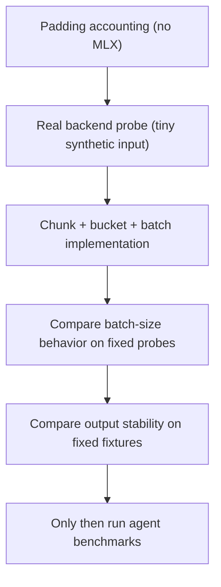

# MLX Performance Testing Ladder

Needle's MLX performance work should start with cheap, local tests before
touching SWE-bench. The goal is to understand one backend call well enough that
batching work is reviewable by a human, not only by an agent.

## What Each Layer Answers

| Layer | Command | Answers |
| --- | --- | --- |
| Padding accounting | `PYTHONPATH=. python3 tools/mlx_padding_probe.py --lengths 100,120,2000` | How much work is fake padding under different batch plans? |
| Pure unit test | `PYTHONPATH=. python3 tests/test_code_pruner_profiling.py` | Are the padding/bucketing rules stable without loading MLX? |
| Real tiny probe | `HAY_PROFILE_MLX=1 uv run --extra backend-code-pruner-mlx python3 tools/mlx_backend_probe.py --functions 20 --max-length 2048` | How long did tokenization, graph build, forced eval, host sync, and rendering take? |
| Batch-size probe | `HAY_MLX_MAX_BATCH_SIZE=2 HAY_PROFILE_MLX=1 uv run --extra backend-code-pruner-mlx python3 tools/mlx_backend_probe.py --functions 80 --max-length 1024` | Does a larger batch preserve output, and is it faster on this Mac? |
| Warm sweep | `HAY_PROFILE_MLX=1 uv run --extra backend-code-pruner-mlx python3 tools/mlx_backend_probe.py --compact --functions-list 80 --max-lengths 1024,2048,4096 --batch-sizes 1 --repeats 2` | Which chunk size is fastest after first-shape warmup? |

## Key Terms

- `real_tokens`: token positions that represent actual prompt/code text.
- `pad_tokens`: fake token positions added to make a rectangle.
- `padded_tokens`: total token positions sent to the model.
- `padding_waste_ratio`: `pad_tokens / padded_tokens`.
- `work_multiplier`: `padded_tokens / real_tokens`.
- `profile_forced_eval`: whether the probe forced MLX to finish model work before
  timing the host sync. This matters because MLX is lazy.
- `retained_hidden_states`: how many layer outputs the scorer actually keeps.
- `mlx_peak_mb_max`: maximum MLX active/cache memory observed during a profiled
  prune call.

## First Heuristic

These labels are not universal laws. They are a starting point for deciding
which batches deserve suspicion:

| Padding waste | Label |
| ---: | --- |
| 0-20% | fine |
| 20-40% | measure |
| 40%+ | bad |

The real rule is still: a bucket is too wide when padding waste costs more than
batching saves.

## Current Local Signal

The backend now splits long text into token chunks, groups similar chunks, and
can run each group through MLX as `[B, L]`. On the M1 Air probes,
`HAY_MLX_MAX_BATCH_SIZE=2` and `3` preserved output but did not improve warm
latency versus serial full-coverage chunks, and larger batches raised peak MLX
memory. The default is therefore `1`: cover the whole input without truncation,
but process one dynamic-length chunk at a time unless profiling on another
machine proves batching is faster.

The current MLX scorer retains only the hidden states it consumes. For the
Qwen/code-pruner path, that is usually 3 of 29 available states. On the 40
function smoke probe this was output-stable but roughly latency-neutral, so it
should be treated as a memory/accountability cleanup rather than a proven speed
win.

On the synthetic 80-function probe, `HAY_MAX_LENGTH=1024` was the best warm
laptop setting tested:

| max length | chunks | warm total | peak MLX |
| ---: | ---: | ---: | ---: |
| 1024 | 3 | ~3.07s | ~2.43 GB |
| 2048 | 2 | ~3.31s | ~2.66 GB |
| 4096 | 1 | ~3.46s | ~2.77 GB |

That points at sequence-length compute/attention cost rather than host sync or
simple fixed per-call overhead. `HAY_MLX_CLEAR_CACHE_AFTER_PRUNE=0` did not
improve warm latency in the same probe, and left about 1.3 GB of MLX cache
resident, so cache clearing remains the safer laptop default.
