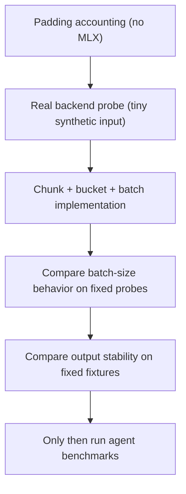

# MLX Performance Testing Ladder

Needle's MLX performance work should start with cheap, local tests before
touching SWE-bench. The goal is to understand one backend call well enough that
batching work is reviewable by a human, not only by an agent.

## What Each Layer Answers

| Layer | Command | Answers |
| --- | --- | --- |
| Padding accounting | `PYTHONPATH=. python3 tools/mlx_padding_probe.py --lengths 100,120,2000` | How much work is fake padding under different batch plans? |
| Pure unit test | `PYTHONPATH=. python3 tests/test_code_pruner_profiling.py` | Are the padding/bucketing rules stable without loading MLX? |
| Real tiny probe | `HAY_PROFILE_MLX=1 uv run --extra backend-code-pruner-mlx python3 tools/mlx_backend_probe.py --functions 20 --max-length 2048` | How long did tokenization, graph build, forced eval, host sync, and rendering take? |
| Batch-size probe | `HAY_MLX_MAX_BATCH_SIZE=2 HAY_PROFILE_MLX=1 uv run --extra backend-code-pruner-mlx python3 tools/mlx_backend_probe.py --functions 80 --max-length 1024` | Does a larger batch preserve output, and is it faster on this Mac? |

## Key Terms

- `real_tokens`: token positions that represent actual prompt/code text.
- `pad_tokens`: fake token positions added to make a rectangle.
- `padded_tokens`: total token positions sent to the model.
- `padding_waste_ratio`: `pad_tokens / padded_tokens`.
- `work_multiplier`: `padded_tokens / real_tokens`.
- `profile_forced_eval`: whether the probe forced MLX to finish model work before
  timing the host sync. This matters because MLX is lazy.

## First Heuristic

These labels are not universal laws. They are a starting point for deciding
which batches deserve suspicion:

| Padding waste | Label |
| ---: | --- |
| 0-20% | fine |
| 20-40% | measure |
| 40%+ | bad |

The real rule is still: a bucket is too wide when padding waste costs more than
batching saves.

## Current Local Signal

The backend now splits long text into token chunks, groups similar chunks, and
can run each group through MLX as `[B, L]`. On the M1 Air probes,
`HAY_MLX_MAX_BATCH_SIZE=2` preserved output but did not improve latency versus
serial full-coverage chunks. The default is therefore `1`: cover the whole input
without truncation, but process one dynamic-length chunk at a time unless
profiling on another machine proves batching is faster.
